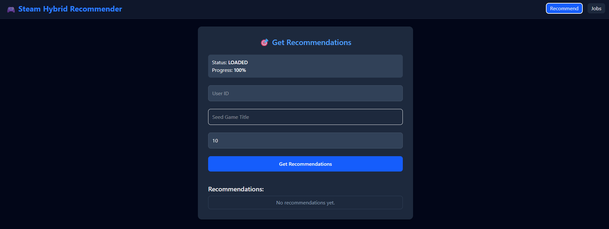
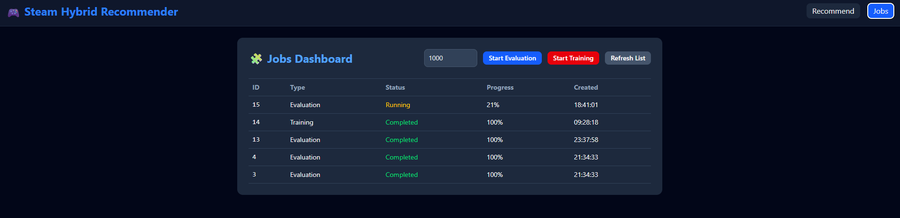
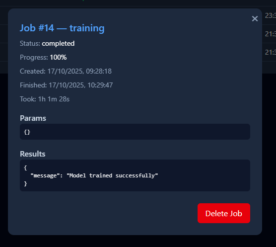
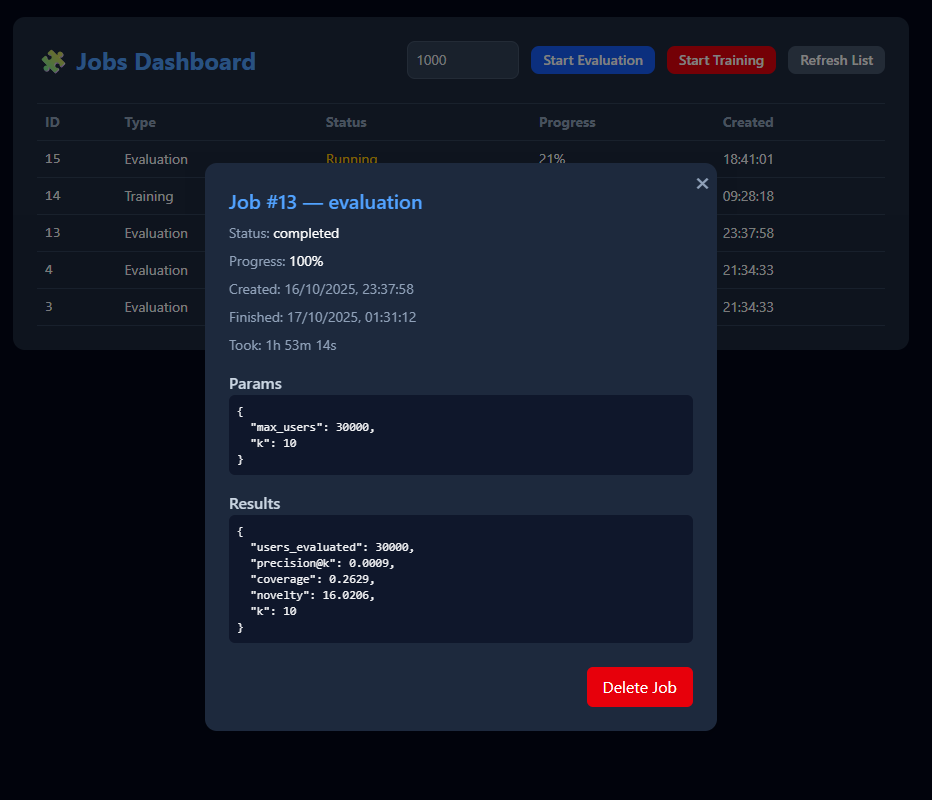
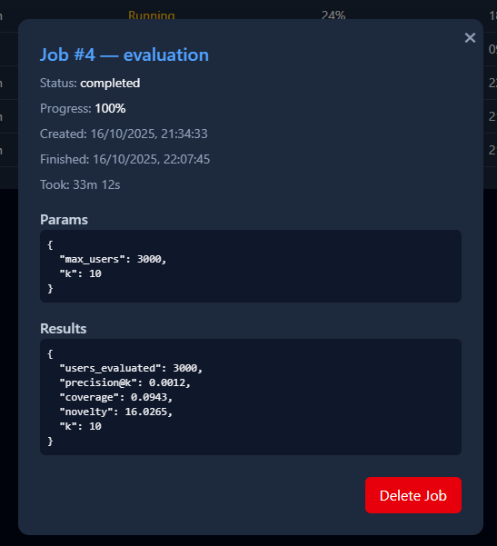
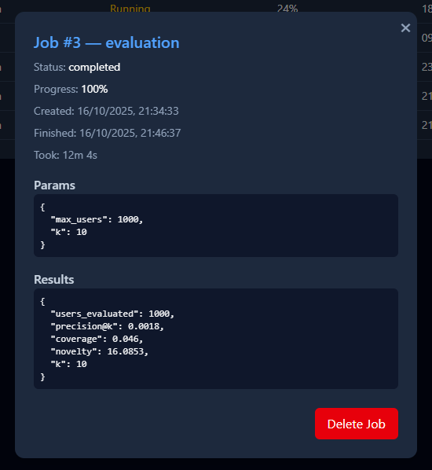
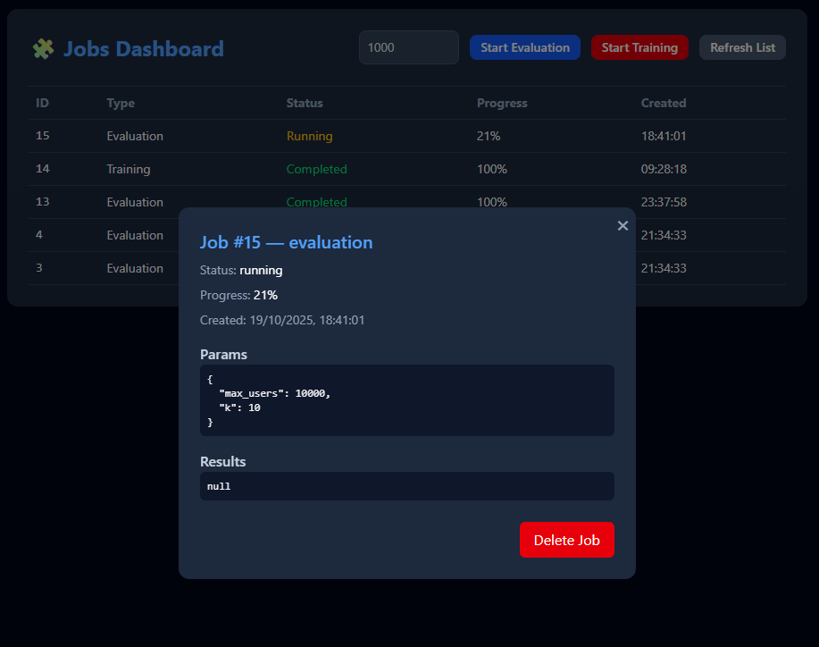
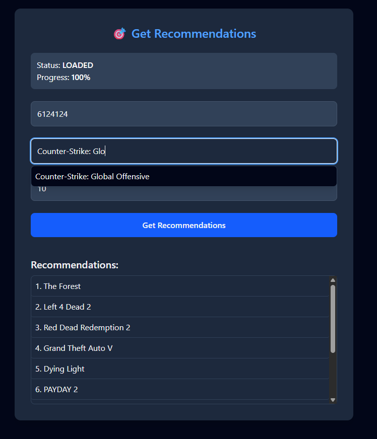
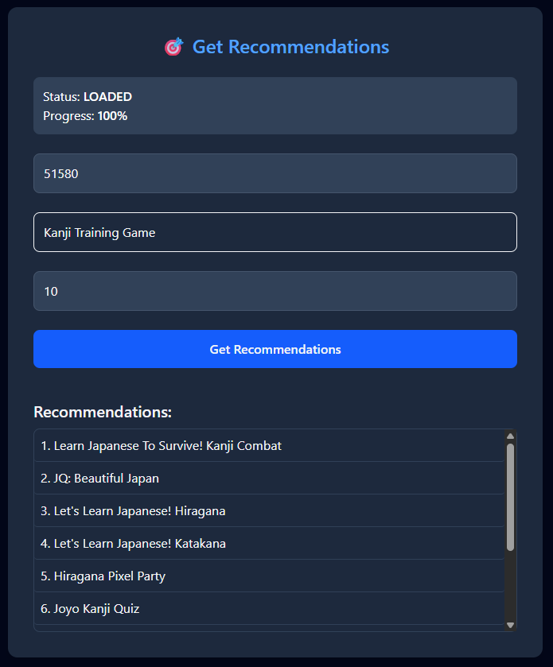
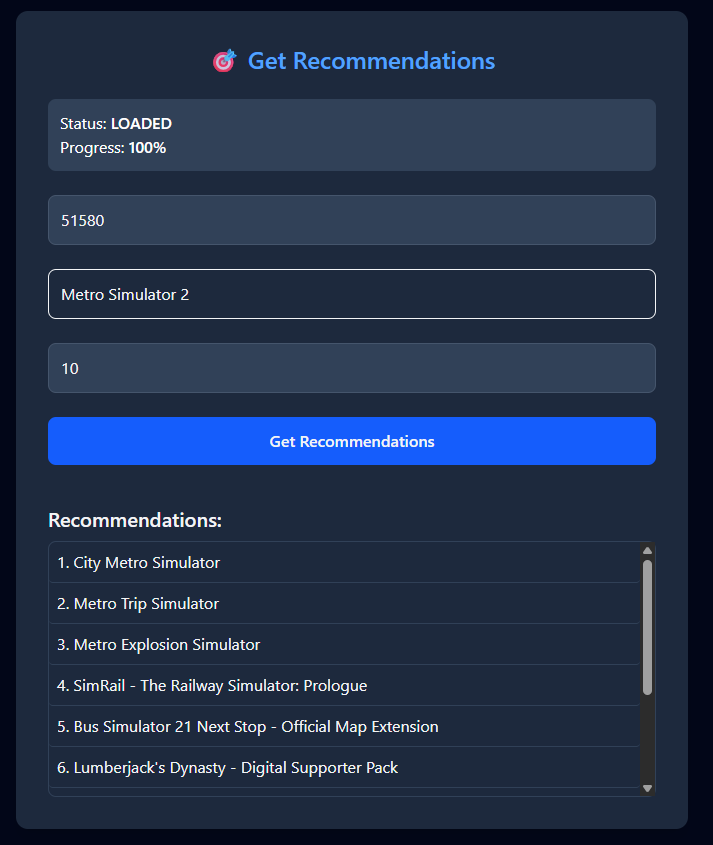

# Steam spel rekomender

Vi skapade ett rekomendationssystem för spel på steam.

### Metoder

**För att läsa om EDA metoderna ta dig till filen EDA.ipynb**

Vi använde oss av hela datasettet, detta orsakade problem för att det är så stort. I eftertanke borde vi kanske ha bara tagit ett sampel av datan för projektet t.ex. 1000 rader eller dylikt.
Som bas för projeketet använde vi oss av uppgift 6 kod och modifierade den att passa in med nya datan. Men det fungerade inte för att datasettet var så stort och vi måste ta och ändra vårt program så att den kunde köras.

### Visualisering

Vi skapade en API och webbsida för vårt system där man kan få rekomenderat spel åt sig.
Bild på UIn som skapats:

### Resultat

När modellen är tränad så får du ett medelande i UIn:

#### EDA

**EDA metrics och resultat finns i EDA.ipynb filen**

#### Metrics

För vår modell som vi skapade fick vi följande evaluerings resultat:

#### Exempel rekomendation

Här kommer ett exempel av vad som systemet kan ge ut och hur de kan se ut:

### Analys av resultat

Överlag är vi nöjda med vad vi åstadkommit, ett fungerande rekomendationssytem. Problem som vi fattade sent var att datasettet innehöll förutom spel så DLC och soundtrack produkter som i sig försämrade våra resultat. Men pga att vi använde hela data settet hade vi inte en chans att kunna sortera och rensa datan för hand (över 50 000 rader). Orsaken till att det skulle ha måsta rensats för hand var att det inte fanns några identifierare direkt i datan så det fanns inget snabbt eller enkelt sätt att få fram typen av produkt.

Resultaten vi fick var lyckade och fungerande.
